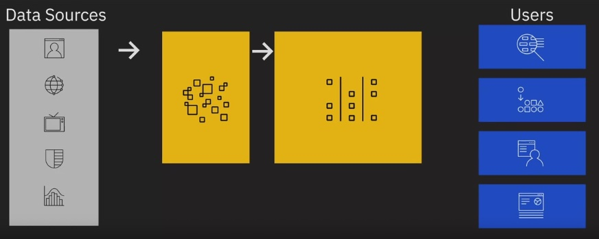

# **__Modern Data Ecosystem and role of Data Engineering__**

# Learning Objective
- Recall the different entities that form a modern data ecosystem.
- Describe and differentiate between the role and responsibilities of Data Engineers, Data Scientists, Data - - Analysts, Business Analysts, and Business Intelligence Analysts.
- Explain what Data Engineering is.
- List the tasks that need to be performed in a typical data engineering lifecycle.
- Recall the essential skills and qualities for data engineering as identified by data professionals.
- Summarize how Data Engineering has evolved over the past few decades.
- Discuss the responsibilities and skillsets of a Data Engineer.
- Recall the various ways that data professionals define data engineering and differentiate it from data analysis and data science.
- Describe what a day in the life of a Data Engineer looks like.
- Create an IBM Cloud account.

# **Course Overview**
## The data serve values
The value depend on
1. Accuaracy
2. Accesibility

## In this course you're going to learn
1. Core Concepts
2. Ecosytem
3. Life Cycle

- Data
- Data Repositiories
- Data Piopelines
- Data Integration Platforms
- Big Data
- Data Platforms
- Data Stores
- ETL Process
- ELT Process
- Data Security
- Data Privacy
- Governance and Compliance
___

# **Modern Data Ecosystem**
Increasing of processing and bandwidth -> Increasing invension of new tools

## A modern data ecosystem includes a whole network of
- Interconnected
- Indepandent
- Continually evolving entites

## The enterprise data environmet
 

- Data integrated from disparate sources
- Different types of analysis skills to generate insights
- Stakeholders to collaborate and act on inside generated
- Tools, applications, and infrastructure to store process and diseminate data as required

__Steps__
1. Pull a copy of the data from the original sourcess into a data repository.
   The data source include: Structured, and Unstructured \
    **Challenge:** Relaibility, security, amd intgrity of the data
2. Raw data needs to get
    - Organised
    - Clean up
    - Optimized for access
    - Conform to compliance and standards enforced in the organisation
  
    **Challenge:** Data management, Repositories that provide high availability, flexibility, accessibility, and security.
3. Finally Users Business stakeholders, Application, Programmers / Analysts, Data Science use cases \
    pulling the data form data respositories \
    **Challenges:** Create Interfaces, APIs, Applications that can get the data to the end users with specific needs

## Emerging technologies shaping the modern data ecosystem

- Every enterprise today has access to limitless storage, high-performance computing, open source technologies, machine learning technologies, and the latest tools and libraries
- Data Scientists are creating predictive models by training machine learning algorithms on past data
- Big Data is paving the way for new tools and techniques and also new knowledge and insights
___

# Key Players in the Data Ecosystem
## Overview
Data Professionals:
- Data Engineers
- Data Analysts
- Data Scientists
- Business Analysts
- Business Intelligence Analysts
Tap into data and turn into actionable insights

## Data engineer
- Develop data architectures
- Make the data available for business operations and Analysis
- Data Engineers work within the data ecosystem to:
  - Extract, integrate, and organize data from disparate sources
  - Clean, transform, and prepare data
  - Design, store, and manage data in data repositories

### Skills
- Programming
- Systems and technology architectures
- Databases data stores

## Data Analyis
Turn translate data and numbers to plain language so organizations can make decisions.

### Responsibilities
- Inspect and clean data for deriving insights
- Identify correlations, find patterns, and apply statistical methods to analyze and mine data
- Visualize data to interpret and present the findings of data analysis
- Working with quesions like:
    - "Are the users' search experiences generally good or bad with the search functionality on our site?"
    - "What is the popular perception of people regarding our rebranding initiatives?"
    - "Is there a co-relation between sales of one product and another?"

### Skills
- Good knowledge of spreadsheets, writing queries, and using statistical tools to create charts and dashboards
- Programming skills
- Strong analytical and story-telling skills

## Data Scientist
### Responsibilities of a Data Scientist:
- Analyze data for actionable insights
- Create predictive models using Machine
Learning and Deep Learning
- Working with quesions like:
  - "How many new social media followers am I likely to get next month?"
  - "What percentage of my customers am I likely to lose to competition in the next quarter?"
  - "Is this financial transaction unusual for this customer?"

### Skills:
- Knowledge of Mathematics and Statistics
- Understanding of programming languages, databases, and building data models
-  Domain knowledge

## Business Analyst and BI Analyst
Business Analysts leverage the work of Data Analysts and Data Scientists to look at possible implications for their business and the actions they need to take or recommend.

### BI Analysts has addition responsibilities to:
- Focus on market forces and external influences that shape their business
- Organize and monitor data on different business functions
- Explore data to extract insights and actionables that improve business performance

## To Summarize
- Data Engineering convert raw data into usable data
- Data Analytics use this data to generate insights
- Data Scientists use Data Analytics and Data Engineering to predict the future using data from the past
- Business Analysts and Business Intelligence Analysts use these insights and predictions to drive decisions that benefit and grow their business

# What is Data Engineering?
The field of Data Engineering concerns itself with the mechanics for the flow and access of data. Its goal is to make quality data available for fact-finding and data-driven decision making.

## The field of Data Engineering involes:
1. Collection source data
   - Extracting, integrating, and organizing data from disparate sources
      - Data acquisition from multiple sources
      - Data architecture for storing source data
2. Processing data
   - Cleaning, transforming, and preparing data to make it usable
      - Distributed systems for processing data
      - Pipelines for extracting, transforming, and loading data
      - Solutions for safeguarding quality, privacy, and security of data
      - Performance optimization
      - Adherence to compliance guidelines
3. Storing data
   - Storing data for reliability and easy availability of data
      - Data stores for storage of processed data
      - Scalable systems
      - Ensuring data privacy, security, compliance, monitoring, backup, and recovery
4. Making data available to users securely
   - Making data available to users securely
      - APIs, services, and programs for retrieving data for end-users
      - User access through interfaces and dashboards
      - Checks and balances to ensure data security

## Conclusion
The field of Data Engineering:
- Provides a robust and scalable structure to make quality data available for decision-making
- Includes the tools and technologies involved in data manipulation
- Involves understanding the complexities of data and how it is leveraged for fact-finding and decision-making