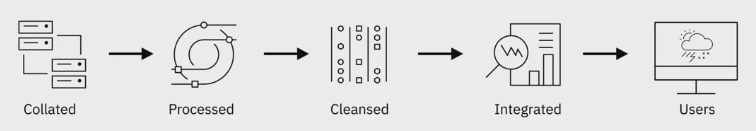

# Learning Objectives

- Describe the elements of a data engineering ecosystem which includes data, data repositories, data integration platforms, data pipelines, languages, and BI and Reporting tools.
- Differentiate between the three structures of data: structured, semi-structured, and unstructured.
- Compare and contrast standard file formats for Data Engineering.
- Describe common sources of data including relational databases; flat files and XML datasets; APIs and web services; web scraping; and data streams and feeds.
- Explain the characteristics and use of some of the programming, querying, and scripting languages relevant to data professionals.
- Define metadata management and explain its importance.
- Explain what data repositories are and the purpose they serve.
- Describe RDBMSs, list examples of them, and summarize their use cases, advantages, and disadvantages.
- Recall experiences that data professionals have had working with varied data sources and types.
- Describe RDBMSes and NoSQL databases as well as examples of use.
- Define NoSQL databases and list their types.
- Differentiate between RDBMs and NoSQL databases.
- Discuss the characteristics and applications of data warehouses, data marts, and data lakes.
- List essential considerations for choosing a data repository.
- Summarize ETL and ELT process as well as data pipelines.
- Explain the use of Data Integration Platforms and how they relate to data pipelines and the ETL and ELT processes.
- Recall the data engineering tools, databases, and data repositories with which data professionals work.
- Create a Db2 instance on IBM Cloud.
- Summarize what big data is and how it impacts the collection, monitoring, storage, analysis, and reporting of data.
- Discuss the role that Apache Hadoop, Apache Hive, and Apache Spark play in Big Data analytics.
- Recall various data professionals’ viewpoints regarding Big Data’s impact on data engineering.

# The Data Engineering Ecosystem

# **The Data Ecosystem and Languages for Data Professionals**

# Overview
## A Data Engineer's ecosystem includes the infrastructure, tools, frameworks, and processes for:
- Extracting data from disparate sources
- Architecting and managing data pipelines for transformation, integration, and storage ot data
- Architecting and managing data repositories
- Automating and optimizing workflows and flow of data between systems
- Developing applications needed through the data engineering workflow

## Type of Data
- Structured \
  Data that follows a rigid format and can be organized into rows and columns.
- Semi-structured \
  Mix of data that has consistent characteristics and data that does not conform to a rigid structure.
- Unstructured \
  Data that is complex and mostly qualitative information that cannot be structured into rows and columns.

## Data Sources
- Relational Database
- Non-Relational Database
- APIs
- Web Services
- Data Streams
- Social Platforms
- Sensor Devices

## Data Repositories
- Transactional or Online Transaction Processing (OLTP) System
  - Designed to store high volume day-to-day operational data
  - Typically relational, some non-relational
- Analytical or Online Analytical Processing (OLAP) Systems
  - Optimized for conduction complex data analytics
  - Include relational and non-relational databases, data warehouses, data marts, data lakes, and bid data stores

## Data Integration

Combiune data from dispated sources into a unified view, accessed by users to query and manipulate the data
 

## Data Pipeline
A set of tools and processes that cover the entire journey of data from source to destivation systems.

## Languages
Query languages: SQL for querying and manipulating data
Programming languages: Python for developing data applications
Shell and Scripting languages: repetitive operational tasks

## Business Intelligence (BI) and Reporting Tools
- Collect data from multiple data sources and present them in a visual format, such as interactive dashboards
- Visualize data in real-time and pre-defined schedule
- Drag and drop products that do not require knowledge of programming

# Types of Data
- Structured Data
- Semi-Structured Data
- Unstructured

## Structured Data
Structured data is data that is well organized in formats that can be stored in databases and lends itself to standard data analysis methods and tools
- Has a well-defined structure
- Can be stored in well-defined schemas
- Can be represented in a tabular manner with rows and columns

## Semi-Structured Data
Semi-structured data is data that is somewhat organized and relies on meta tags for grouping and hierarchy
- Has some organizational properties but lacks a fixed or rigid schema
- Cannot be stored in the form of rows and columns as in databases
- Contains tags and elements, or metadata, which is used to group data and organize it in a hierarchy

## Unstructured Data
Unstructured data is data that is not conventionally organized in the form of rows and columns in a particular format
- Does not have an easily identifiable structure
- Cannot be organized in a mainstream relational database in the form of rows and columns
- Does not follow any particular format, sequence, semantics, or rules

# Understanding Different Types of File Formats
Standard file formats:
1. Delimited text file formats, or .CSV \
   Files used to store data as text. Each value is separated by a delimiter
2. Microsoft Excel Open .XML Spreadsheet, or XLSX \
   - Open file format, accessible to most other applications
   - Can use and save all functions available in excel
   - Is a secure file format as it cannot save malicious code
3. Extensible Markup Language, or .XML \
    Extensible Markup Language, or XML, is a markup language with set rules for encoding data.
   - Readable by both humans and machines
   - Self-descriptive language
   - Similar to .HTML in some respects
   - Does not use predefined tags like .HTML does
   - Platform independent
   - Programming language independent
   - Makes it simpler to share data between systems
4. Portable Document Format, or .PDF \
    It presents documents independent of application software, hardware, and operating systems.
    - Can be viewed the same way on any device
    - Is frequently used in legal and financial documents
    - Can also be used to fill in data for forms
5. JavaScript Object Notation, or .JSON \
   is a text-based open standard designed for transmitting structured data over the web.
   - Language-independent data format
   - Can be read in any programming language
   - Easy to use
   - Compatible with a wide range of browsers
   - Considered as one of the best tools for sharing data